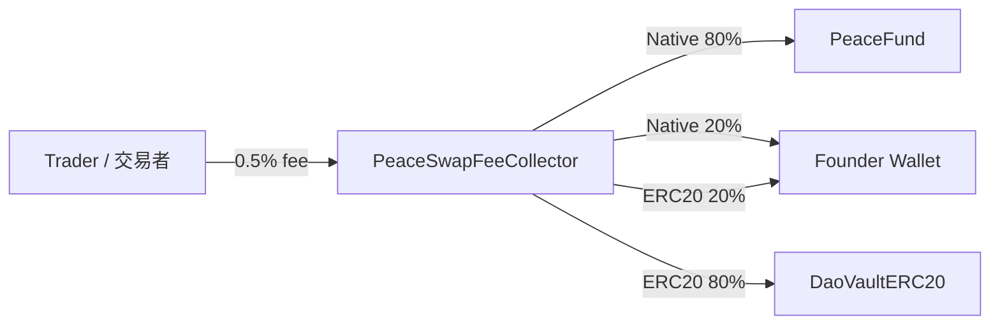

> **For Binance engineers**  
> This repo demonstrates a **BNB-funded public treasury** governed by **$世界和平** token roles:  
> 100 = Speak, 200k = Vote, 1M = Propose (stake 1M, refunded after the vote).  
> All donation flows are **transparent on-chain** via `PeaceFund`.

 
# 🕊️ PeaceDAO Demo  
**Token-Verified DAO Chat & Governance Prototype**  

---
> This prototype responds to recent community scam incidents and suggests a token-verified governance pattern Binance engineers could explore.

### 💡 Vision
Decentralization without verification leads to chaos.  
PeaceDAO explores a **token-verified governance framework** that gives identity, accountability, and structure to decentralized communities.

> *"Peace needs protection — even on-chain."* ☮️

---

### Core Concept

A token-verified **public good DAO** where:
- **100 $世界和平** → speak in token-gated chat
- **200,000 $世界和平** → vote on proposals
- **1,000,000 $世界和平** → create proposals (requires staking 1,000,000; fully refunded after voting ends, regardless of result)

All **donations are in BNB** to a public on-chain treasury (PeaceFund).  
$世界和平 is strictly for **governance/identity** — not the donation currency.

---

### ⚙️ Smart Contract Overview / 合約總覽

- `PeaceGate.sol` — role verification based on ERC-20 balance / 角色驗證
  - Thresholds (stored in smallest units): **100 / 200,000 / 1,000,000** / 門檻值
  - Blacklist & adjustable thresholds (owner) / 黑名單與動態調整
  - `roleOf(address)` returns: NONE / SPEAKER / VOTER / PROPOSER / 查詢角色

- `PeaceDAO.sol` — proposals & voting / 提案與投票
  - **Propose**: PROPOSER must stake **1,000,000 $世界和平** (refunded after voting ends) / 提案需質押 100 萬代幣（投票結束全數退回）
  - **Vote**: VOTER role (≥ 200,000) / 投票需擁有投票角色（≥ 20 萬）
  - **Quorum** configurable; on **pass**, DAO instructs treasury to send **BNB** / 法定門檻可設定，通過後指示金庫撥款
  - **No slashing**: stake is **always refunded**, pass or fail / 無懲罰機制，無論通過與否皆退回質押

- `PeaceFund.sol` — BNB-only treasury / 僅收 BNB 的公益金庫
  - Receives donations in BNB (`receive()` / `donate()`) / 接收 BNB 捐款
  - Executes `transferNative(to, amount, proposalId)` **only when DAO says so** / 依 DAO 指令撥款
  - `balance()` & events for full transparency (Dune/TheGraph ready) / 事件記錄完整透明

- `DaoVaultERC20.sol` — ERC20 vault for DAO-controlled assets / DAO 管理的 ERC20 金庫
  - Receives ERC20 fees forwarded by the fee collector / 收取手續費轉入的 ERC20
  - DAO can withdraw tokens to multisig or execution contracts / DAO 可授權轉出

- `PeaceSwapFeeCollector.sol` — fee routing for swaps / 交易手續費路由器
  - Splits the 0.5% swap fee into DAO (80%) & Founder (20%) / 將 0.5% 手續費拆成 DAO 80%、創辦人 20%
  - Native fees head to `PeaceFund` while ERC20 fees settle in `DaoVaultERC20` / Native 手續費進 PeaceFund，ERC20 進 DaoVaultERC20

### 💸 Fee Routing & Flow / 手續費路由與流向

**English**
- Native swap fees → `PeaceFund` (80%) and founder wallet (20%).
- ERC20 swap fees → `DaoVaultERC20` (80%) and founder wallet (20%).
- Both paths are triggered by `PeaceSwapFeeCollector`, ensuring ERC20 tokens never touch the native-only treasury.

**中文**
- 原生幣手續費 → `PeaceFund`（80%）與創辦人錢包（20%）。
- ERC20 手續費 → `DaoVaultERC20`（80%）與創辦人錢包（20%）。
- 所有分潤皆由 `PeaceSwapFeeCollector` 控制，避免 ERC20 誤送到僅支援原生幣的金庫。



### 🛠️ Configuration & Address Validation / 設定與地址驗證

**English**
- Populate `.env` (see `.env.example`) or `deploy_config.json` with the founder wallet and governance token; environment variables override config files.
- Inspect the live settings with `npx hardhat show:config` to read env/config/deployments side by side.
- Run `node tools/validate-addresses.ts` locally or rely on the CI workflow to catch mismatched founder/token addresses across contracts, scripts, and docs.

**中文**
- 請在 `.env`（參考 `.env.example`）或 `deploy_config.json` 中填入創辦人錢包與治理代幣地址，環境變數會優先覆蓋檔案設定。
- 透過 `npx hardhat show:config` 可一次查看環境變數、設定檔與部署紀錄的實際地址。
- 執行 `node tools/validate-addresses.ts` 或依賴 CI 工作流程，即可偵測合約、腳本與文件中不一致的創辦人／代幣地址。

```
node tools/validate-addresses.ts
npx hardhat show:config
```

CI Workflow: `.github/workflows/validate-addresses.yml`

---

### Current Features

- ✅ On-chain role checking (`roleOf`) with **100/200k/1M** thresholds
- ✅ Proposal creation with **1M stake** (auto-refund after vote ends)
- ✅ BNB-only public treasury with on-chain logs
- ✅ Adjustable params: thresholds, quorum, voting delay/period
- ✅ Event logs for bot integrations (Discord/Guild token-gating)
- ⚙️ Front-end is EIP-1193 **injected wallet–ready** (Binance Web3 Wallet, OKX, MetaMask…)


---

### 🔐 Security & Next Steps
This repository is a **concept demo — not for mainnet deployment**.  
Future improvements include:
1. Snapshot-based voting integration (using `ERC20Snapshot` or Governor).  
2. Role verification via multisig / timelock for additional security.  
3. Expand event logging for audit trails (`RoleGranted`, `Blacklisted`, etc.).  
4. Integrate with a treasury contract (`Gnosis Safe + Timelock`).  
5. Re-entrancy and overflow protection with OpenZeppelin libraries.  

---

### 🤖 Token-Gated Chat Integration
**Goal:** connect contract logic to real community platforms.

Suggested tools:
- Discord / Telegram → [Collab.Land](https://collab.land/) or [Guild.xyz](https://guild.xyz/)  
- Web gating → [Unlock Protocol](https://unlock-protocol.com/)  
- Voting UI → [Snapshot](https://snapshot.org/) / [Tally](https://tally.xyz/)  
- Treasury execution → [Gnosis Safe](https://gnosis-safe.io/)  

**Bot verification logic (simplified):**
1. User clicks *Verify* → bot requests wallet signature (no private key).  
2. Bot checks `roleOf(address)` via RPC.  
3. Grants appropriate chat role (reader / voter / proposer).  
4. Periodically revalidates or on-demand before voting.

---

### 🧠 Why This Matters
Scams in open Telegram communities show how fragile trust can be.  
By introducing **on-chain verified access**, communities can stay open yet secure.  
It’s not about centralization — it’s about *verified decentralization*.

---

### 🧰 For Developers
If you’re a Solidity or Web3 engineer, feel free to:
- Fork this repo  
- Suggest security enhancements  
- Prototype a front-end demo (token-gated chat)  
- Submit pull requests or issues  

---

### 🧑‍💻 Author
Created by **[@0xChris.SKR](https://twitter.com/0xChris_SKR)**  
Project: **[$世界和平](https://twitter.com/search?q=%24世界和平&src=typed_query)**  
No team, no funding — just an idea for a safer decentralized future.  

---

### 🪪 License
MIT License — free to fork, build, and improve.  
Use at your own risk. Not audited.

---
**DISCLAIMER:** Conceptual prototype. Not audited. Not financial advice. Do NOT deploy to mainnet.

